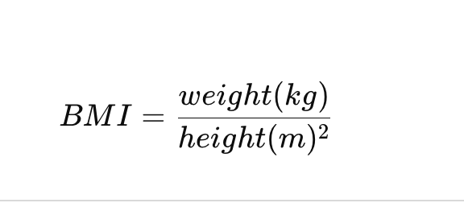
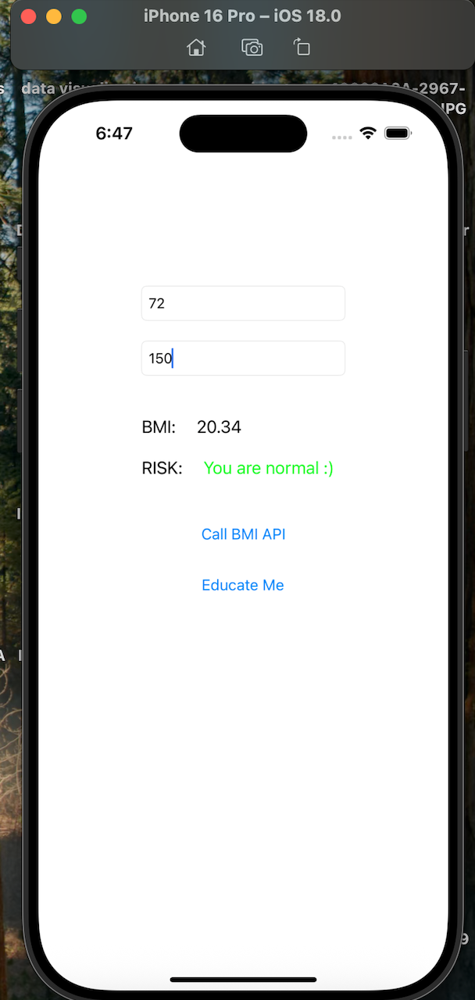

## Overview

BMI Calculator – Part 2 is a simple web application that calculates Body Mass Index (BMI) based on user input (height and weight) and displays the corresponding health category.

This project demonstrates basic web development concepts including user input handling, form validation, and dynamic result display.

## Features

User-friendly interface

Height & weight input

BMI calculation logic

BMI category classification:

Underweight

Normal weight

Overweight

Obese

Input validation

🛠 Technologies Used

HTML

CSS

JavaScript

## BMI Formula Used

	​

## How to Run

Download or clone the repository

Open index.html in your browser

Enter height and weight

Click Calculate

## Project Structure
BMI_Calculator_Part2/
│── index.html
│── style.css
│── script.js
└── README.md

## Purpose

This project is part of learning and practicing front-end development and JavaScript logic implementation.

## Output

